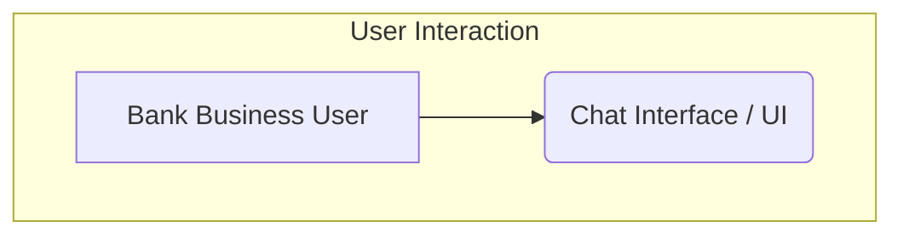

##test

    style MinIO fill:#f9f,stroke:#333,stroke-width:2px
    style Iceberg fill:#a2e,stroke:#333,stroke-width:2px,color:#fff
    style Trino fill:#8c6,stroke:#333,stroke-width:2px
    style J fill:#bbf,stroke:#333,stroke-width:2px
    style L fill:#fcd,stroke:#333,stroke-width:2px
