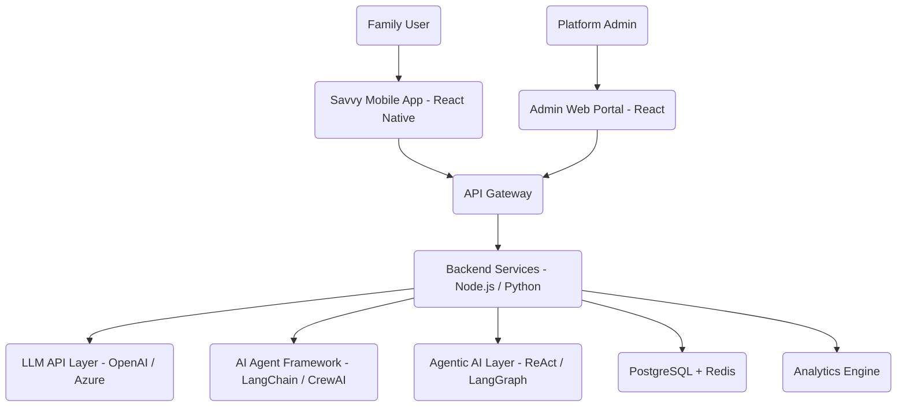

## Context Diagram 

```mermaid
graph TD
  User(Family User)
  Admin(Platform Admin)
  MobileApp("Savvy Mobile App - React Native")
  WebAdmin("Admin Web Portal - React")
  APIGateway("API Gateway")
  Backend("Backend Services - Node.js / Python")
  LLMService("LLM API Layer - OpenAI / Azure")
  AgentEngine("AI Agent Framework - LangChain / CrewAI")
  AgenticEngine("Agentic AI Layer - ReAct / LangGraph")
  Database("PostgreSQL + Redis")
  Analytics("Analytics Engine")

  User --> MobileApp
  Admin --> WebAdmin
  MobileApp --> APIGateway
  WebAdmin --> APIGateway
  APIGateway --> Backend
  Backend --> LLMService
  Backend --> AgentEngine
  Backend --> AgenticEngine
  Backend --> Database
  Backend --> Analytics

```
